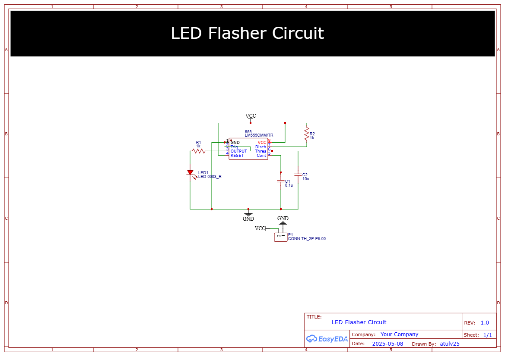

# 💡 555 Timer LED Flasher Circuit with PCB

This project demonstrates a simple **LED flasher/blinker circuit** using a **555 timer IC in astable mode**. It's ideal for electronics beginners and includes PCB design files, a schematic, and a bill of materials.

## 🧠 Working Principle

The 555 timer is configured in astable mode. It continuously toggles its output between high and low, making the LED blink.

## 📷 Preview

## 🔩 Components Required

| Component       | Value        | Quantity |
|----------------|--------------|----------|
| 555 Timer IC    | NE555        | 1        |
| Resistor        | 1kΩ          | 1        |
| Resistor        | 10kΩ         | 1        |
| Capacitor       | 10µF/25V     | 1        |
| LED             | Any color    | 1        |

## 🔧 PCB Design Tips

- Keep traces short and avoid unnecessary loops.
- Place timing components close to the 555 IC.
- Use a ground plane for stability.
- Add a power header for easy battery connection.

